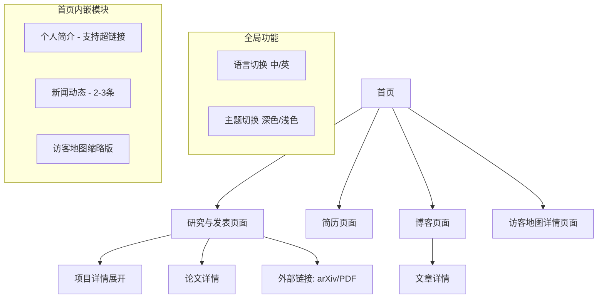

# 个人学术主页产品需求文档

## 1. Product Overview

基于 al-folio Jekyll 模板构建的个人学术主页，为学者和研究人员提供专业的在线展示平台。该网站将展示个人学术成就、研究项目、发表论文和最新动态，帮助建立专业的学术形象和促进学术交流。

* 主要目的：为学者提供专业的在线学术展示平台，展示研究成果、学术背景和最新动态

* 目标用户：学者、研究人员、博士生、教授等学术界人士

* 产品价值：提升学术影响力，促进学术合作与交流，建立专业的在线学术身份

## 2. Core Features

### 2.1 User Roles

本产品主要面向单一用户（网站所有者），无需复杂的用户角色区分。访问者可以浏览所有公开内容。

### 2.2 Feature Module

我们的学术主页需求包含以下主要页面：

1. **首页（Home）**: 个人简介、研究兴趣、教育背景、联系方式、新闻动态、访客地图
2. **研究与发表页面（Research & Publications）**: 研究项目展示、学术论文列表
3. **简历页面（CV）**: 详细简历、工作经历、学术服务、个人兴趣、相关图片
4. **博客页面（Blog）**: 学术博客、技术分享、个人思考

### 2.3 Page Details

| Page Name | Module Name      | Feature description                                            |
| --------- | ---------------- | -------------------------------------------------------------- |
| 首页        | 个人简介区域           | 展示个人照片、姓名、职位、所属机构、研究领域简介，支持嵌入超链接（如实验室名称可点击跳转）                     |
| 首页        | 研究兴趣             | 列出主要研究方向和关键词，支持标签展示                                            |
| 首页        | 教育背景             | 显示学位信息、毕业院校、导师信息                                               |
| 首页        | 联系方式             | 邮箱、办公地址、社交媒体链接                                                 |
| 首页        | 新闻动态             | 时间线格式展示2-3条最新学术动态，无需分类筛选                                       |
| 首页        | 访客地图             | ClustrMaps缩略版地图，显示访客分布，可点击查看详情                                 |
| 研究与发表页面   | 研究项目卡片           | 默认缩略版（图片+标题+简短描述），可展开详细版本，包含arXiv、PDF等外部链接                      |
| 研究与发表页面   | 论文列表             | 按时间倒序显示论文、期刊信息、引用数据                                            |
| 研究与发表页面   | Google Scholar链接 | "See the Google Scholar for the full list of my publications." |
| 研究与发表页面   | 引用信息             | 显示论文引用数、下载链接、BibTeX格式                                          |
| 简历页面      | 教育经历             | 详细的学位信息、时间、院校、专业                                               |
| 简历页面      | 工作经验             | 研究经历、教学经历、实习经历、暑校组织、助教工作，支持上传相关图片                              |
| 简历页面      | 学术服务             | 审稿人经历、学术组织参与                                                   |
| 简历页面      | 个人兴趣             | 兴趣爱好（如羽毛球等）                                                    |
| 简历页面      | 图片展示             | 支持工作经历相关照片的上传和显示                                               |
| 简历页面      | 技能展示             | 编程语言、研究工具、专业技能                                                 |
| 博客页面      | 文章列表             | 按时间展示博客文章，支持分类和标签                                              |
| 博客页面      | 文章详情             | 支持 LaTeX 和 Markdown 格式、数学公式、代码高亮                               |
| 全站功能      | 导航栏              | 顶部导航，包含所有主要页面链接、语言切换、主题切换按钮                                    |
| 全站功能      | 语言切换             | 中英文双语切换按钮，手动翻译内容（非AI翻译）                                        |
| 全站功能      | 主题切换             | 深色/浅色模式切换按钮                                                    |
| 首页        | 访客地图             | ClustrMaps缩略版访客地图，可点击跳转到完整页面                                   |

## 3. Core Process

**主要用户浏览流程：**

访问者通过首页了解学者基本信息和研究背景，然后可以浏览具体的研究项目和发表论文，查看最新学术动态，或下载完整简历。博客页面提供更深入的学术思考和技术分享。

## 4. User Interface Design

### 4.1 Design Style

* **主色调**: 支持深色/浅色主题切换

  * 浅色模式：深蓝色 (#2c3e50) 作为主色，白色 (#ffffff) 作为背景色

  * 深色模式：深色背景配合浅色文字，保持良好对比度

* **辅助色**: 灰色 (#7f8c8d) 用于次要文本，绿色 (#27ae60) 用于强调链接

* **按钮样式**: 圆角矩形按钮，悬停时有渐变效果

* **字体**: 英文使用 "Roboto" 或 "Open Sans"，中文使用系统默认字体

* **字体大小**: 标题 24-32px，正文 16px，小字 14px

* **布局风格**: 简洁的卡片式布局，顶部导航栏固定

* **图标风格**: 使用 Font Awesome 图标库，简洁的线性图标风格

### 4.2 Page Design Overview

| Page Name | Module Name | UI Elements |
|-----------|-------------|-------------|
| 首页 | 个人简介区域 | 圆形头像、大标题姓名、副标题职位、机构链接（可点击）、研究领域标签 |
| 首页 | 研究兴趣 | 标签云样式、悬停效果、颜色渐变 |
| 首页 | 教育背景 | 时间线样式、学校logo、学位信息卡片 |
| 首页 | 联系方式 | 图标+文字、社交媒体按钮、邮箱链接 |
| 首页 | 新闻动态 | 简洁的时间线布局、最多3条动态、日期+内容 |
| 首页 | 访客地图 | 嵌入式缩略地图、统计数字、点击跳转按钮 |
| 研究与发表页面 | 项目卡片 | 默认折叠状态（图片+标题+简介），展开按钮，详细内容区域，外部链接按钮组 |
| 研究与发表页面 | 论文列表 | 列表样式、期刊标签、引用数据、下载按钮 |
| 简历页面 | 整体布局 | 左侧导航、右侧内容、固定头部、滚动效果 |
| 简历页面 | 图片展示 | 图片缩略图、点击放大、图片说明文字 |
| 博客页面 | 文章卡片 | 卡片式布局、标签、摘要、阅读时间 |

### 4.3 Responsiveness

本产品采用桌面优先的响应式设计策略：

* **桌面端**: 完整功能展示，多列布局，丰富的交互效果

* **平板端**: 适配中等屏幕，保持核心功能，调整布局密度

* **移动端**: 单列布局，简化导航，优化触摸交互

* **特殊功能**: 访客地图在移动端显示简化版本，主题切换和语言切换按钮在所有设备上保持可用

