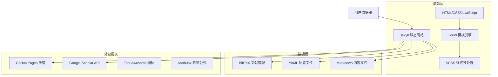
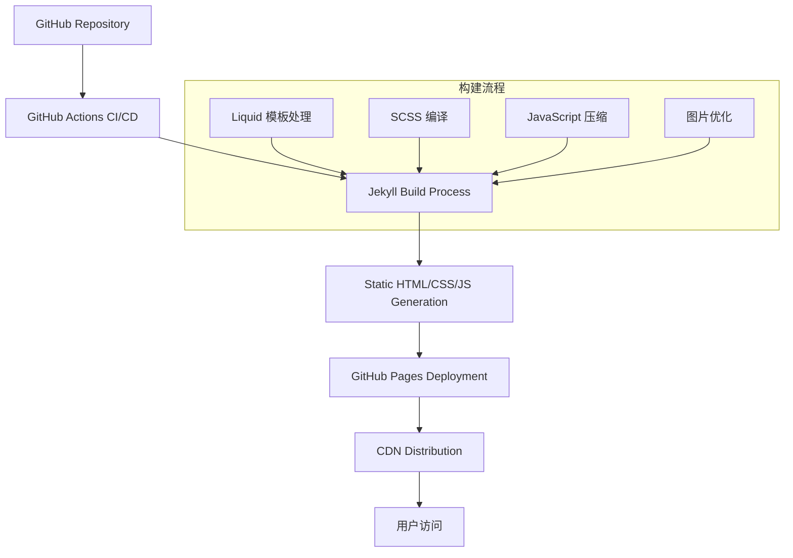
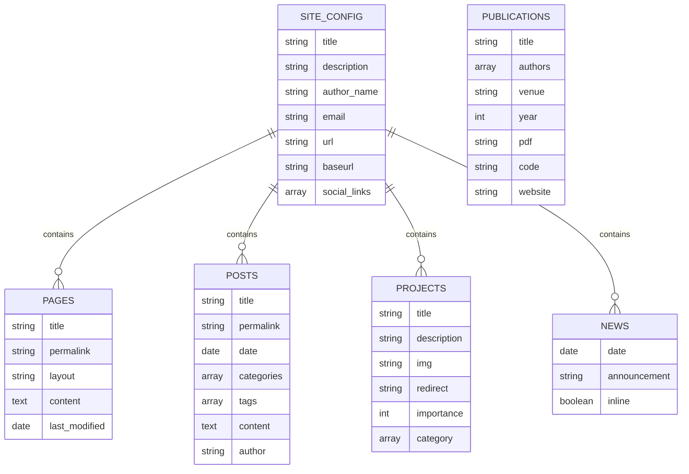

# 学术主页技术架构文档

## 1. Architecture design



## 2. Technology Description

- **前端**: Jekyll@4.3 + Liquid 模板引擎 + SCSS + JavaScript
- **样式框架**: Bootstrap@5.3 + Font Awesome@6.0
- **数学公式**: MathJax@3.2
- **文献管理**: BibTeX + Jekyll-Scholar 插件
- **部署平台**: GitHub Pages
- **版本控制**: Git + GitHub

## 3. Route definitions

| Route | Purpose |
|-------|---------|
| / | 首页，展示个人简介、研究兴趣和基本信息 |
| /news/ | 新闻页面，显示最新学术动态和公告 |
| /projects/ | 研究项目页面，展示研究项目和成果 |
| /publications/ | 发表论文页面，列出学术论文和引用信息 |
| /cv/ | 简历页面，展示详细的学术简历 |
| /blog/ | 博客页面，显示学术博客文章列表 |
| /blog/:year/:title/ | 博客文章详情页，显示具体文章内容 |
| /repositories/ | 代码仓库页面，展示 GitHub 项目 |
| /teaching/ | 教学页面，展示教学经历和课程信息 |

## 4. API definitions

### 4.1 Core API

由于 Jekyll 是静态网站生成器，主要通过配置文件和插件与外部服务交互：

**Google Scholar 集成**
```yaml
# _config.yml 配置
scholar:
  last_name: [Your Last Name]
  first_name: [Your First Name]
  style: apa
  locale: en
  source: ./_bibliography
  bibliography: papers.bib
  bibliography_template: bib
  replace_strings: true
  join_strings: true
  details_dir: bibliography
  details_layout: bibtex.html
  details_link: Details
  query: "@*"
```

**GitHub API 集成**
```yaml
# _config.yml 配置
github_username: [your-github-username]
github_repos:
  - repo-name-1
  - repo-name-2
```

## 5. Server architecture diagram



## 6. Data model

### 6.1 Data model definition



### 6.2 Data Definition Language

**网站配置文件 (_config.yml)**
```yaml
# 基本信息
title: "Your Academic Homepage"
first_name: "Your First Name"
last_name: "Your Last Name"
email: "your.email@university.edu"
description: "A brief description of your research"

# 社交媒体链接
scholar_userid: your-google-scholar-id
orcid_id: 0000-0000-0000-0000
github_username: your-github-username
linkedin_username: your-linkedin-username
twitter_username: your-twitter-username

# 网站设置
url: "https://your-username.github.io"
baseurl: ""
lang: en
icon: ⚛️

# 主题设置
repo_theme_light: default
repo_theme_dark: dark
```

**个人信息数据 (_data/cv.yml)**
```yaml
- title: Education
  type: time_table
  contents:
    - title: Ph.D. in Computer Science
      institution: University Name
      year: 2020-2024
      description:
        - Advisor: Prof. Name
        - Thesis: "Your Thesis Title"
        
- title: Experience
  type: time_table
  contents:
    - title: Research Assistant
      institution: Lab Name
      year: 2020-2024
      description: Research on machine learning and AI
```

**新闻数据 (_news/)**
```markdown
---
layout: post
date: 2024-01-15
inline: true
---

Our paper "Paper Title" has been accepted to Conference Name 2024!
```

**项目数据 (_projects/)**
```markdown
---
layout: page
title: Project Title
description: Brief project description
img: assets/img/project_thumbnail.jpg
importance: 1
category: research
---

Detailed project description with images, code, and results.
```

**论文数据 (_bibliography/papers.bib)**
```bibtex
@article{author2024title,
  title={Your Paper Title},
  author={Your Name and Coauthor Name},
  journal={Journal Name},
  year={2024},
  publisher={Publisher},
  pdf={paper.pdf},
  code={https://github.com/username/repo},
  website={https://project-website.com}
}
```